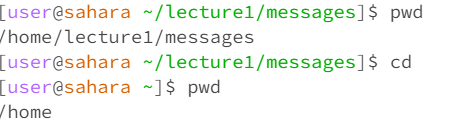
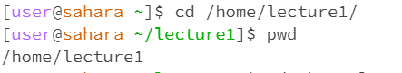
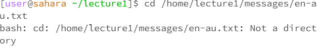
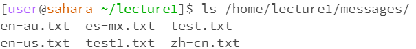
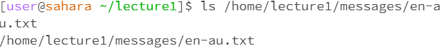
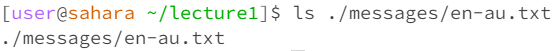
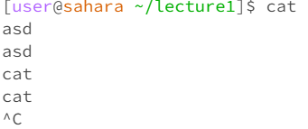
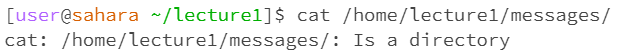
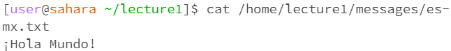

 

In this example the working directery was "/home/lecture1/messages" which is shown by the pwd command that follows. After typing the cd command with no arguments, the working directory was changed to "/home" and there is no output. We can see that by the following pwd command. There was no error.

In this example the working directory was "/home" and I changed it to "/home/lecture1". There was no output but the working directory was changed and that is shown by the following pwd command. There was no output and no error.

In this example the working directory is Home/Lecture1. The output I got indicated I had en error because I can't make a file a working directory.

The command "ls" shows what files are inside a directory. In this example, no arguments were provided for the "ls" command and because the working directiory is Home/Lecture1, the output showed what's inside Home/Lecture1. There was no error.

In this example, I used the "ls" command to show what's inside the directory Home/Lecture1/messages. The output showed the language files that are inside the folder. The working directory was Home/Lecture1 and there was no error.

In this example I used the "ls" command on a file. The command shows what files or direcctories are inside a directory but because I used it on a file the output was just the location of the file. In the first example, because we used an absolute path the "ls" command returns the absolute path. In the second example, because I used a relative path the "ls" command returns the absolute path. The working directory was "Home/Lecture1" and the output was not an error.

The command "cat" prints out what's inside a file. In this example, I haven't provided "cat" with an argument. I tried to keep typing and pressing enter and the cat command kept printing what I typed each time after I pressed enter until I terminated the command. The working directory was Home/Lecture1 and there was no output and no error message.

In this example I used the "cat" command on a directory, and since the directory just conatins more directories and files, the command can't print what's inside the directory. The working directory was /Home/Lecture1 and there was an error message because the "cat" command doesn't work on a directory. 

In this example I used the "cat" command on a file and the output was the text that was inside that file because cat prints out what's inside a file. THe working directory was /Home/Lecture1 and there was no error message.
