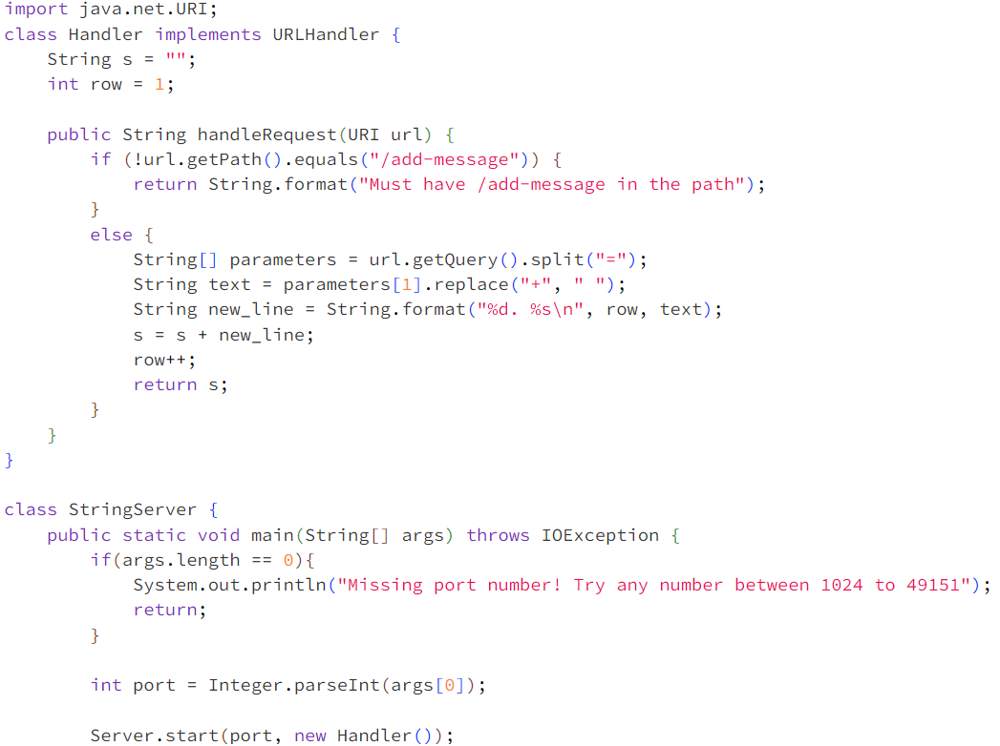
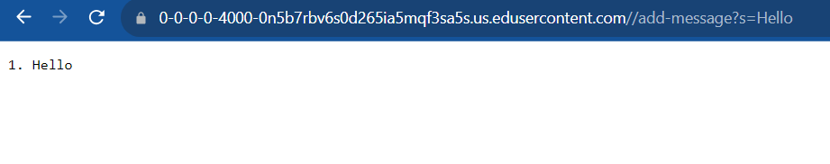
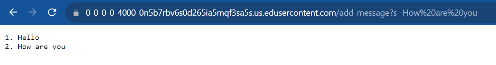
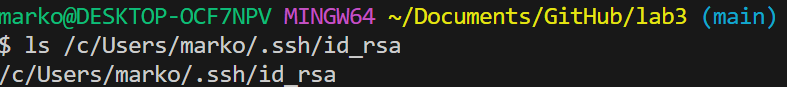
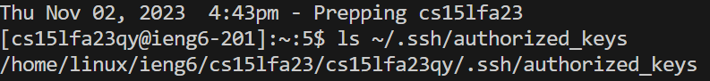
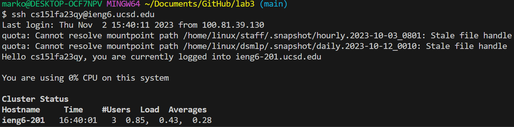

# Part 1 #

The String Class

Implementation

### Answers for screenshot 1 ###

* Which methods in your code are called?

The `HandleRequest` method is being called.

* What are the relevant arguments to those methods, and the values of any relevant fields of the class?

The argument for the method is the url which is the url the user provides. The string parameter `String s`, starts as an empty string and it is what gets returned at the end of the method. The parameter `int row`, keeps track of the number of rows and it`s value at the beginning is 1.

* How do the values of any relevant fields of the class change from this specific request? If no values got changed, explain why.

A temporary string list parameter(`parameters`) gets the value that`s right after the `=` in the query as its second element of the list and what`s before as its first element. The second element in the list has the value "Hello". The `+` in the string(second element of the string list) are replaced by spaces(nothing happens since there are no spaces) and the result is stored in a new temporary string(`text`). A new row, row number(row = 2), and the previous temporary string(`text`) are added to a new temporary string(`new_line`) using `String.format`. Now the temporary string(`new_line`) is `"1. Hello\n"`. `s` is also `"1. Hello\n"` since s was empty before we appended it. The string is appended to `s` and `s` is returned. The `row` variable gets incremented before `s` is returned. Now `row = 2`. 

 ### Answers for screenshot 2 ###

* Which methods in your code are called?
  
The `HandleRequest` method is being called.

* What are the relevant arguments to those methods, and the values of any relevant fields of the class?

The argument for the method is `url` which gets the new URL inputted. The value of `s` is "Hello \n" and `row = 2` from the previous function call. 

* How do the values of any relevant fields of the class change from this specific request? If no values got changed, explain why.

A temporary string parameter(`parameters`) gets the value that's right after the `=` in the query as its second element of the list and what's before as its first element. The value of the second string element will be "How+are+you". The `+` in the string are replaced by spaces and the result, "How are you", is stored in a new temporary string(`text`). A new row, row number(row = 2"), and the previous temporary string(`text`) are added to a new temporary string(`new_line`) using `String.format`. Now the temporary string(`new_line`) is `"2. How are you\n"`. The string is appended to `s`. `s` is now `"1. Hello\n2. How are you\n"`. The `row` variable gets incremented and `s` is returned. 

# Part 2 #

* The path to the private key for your SSH key for logging into ieng6 (on your computer or on the home directory of the lab computer)

  
* The path to the public key for your SSH key for logging into ieng6 (within your account on ieng6)

  
* A terminal interaction where you log into ieng6 with your course-specific account without being asked for a password.

# Part 3 #

I learned that I can create a keygen that will automatically be called when I try to log in to the server. I also found it interesting that I can see what files there are in a computer that I am connected to using ls. Even though it`s a bit beyond the scope of this course I also learned that we need to have a server class and a URLHandler to run a server. 
