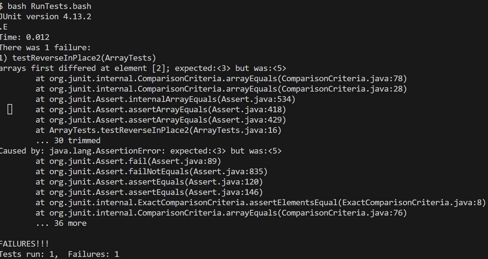

A failure-inducing input for the buggy program, as a JUnit test and any associated code (write it as a code block in Markdown)

```ruby
@Test 
public void testReverseInPlace2() {
	int[] input2 = {3,4,5 };
	ArrayExamples.reverseInPlace(input2);
	assertArrayEquals(new int[]{5,4,3 }, input2);
}


```


An input that doesn’t induce a failure, as a JUnit test and any associated code (write it as a code block in Markdown)

```ruby
@Test 
public void testReverseInPlace1() {
    int[] input1 = { 3 };
    ArrayExamples.reverseInPlace(input1);
    assertArrayEquals(new int[]{ 3 }, input1);
}
```

The symptom, as the output of running the tests (provide it as a screenshot of running JUnit with at least the two inputs above)

Input that doesn't include failure


Input that induces failure





The bug, as the before-and-after code change required to fix it (as two code blocks in Markdown)
