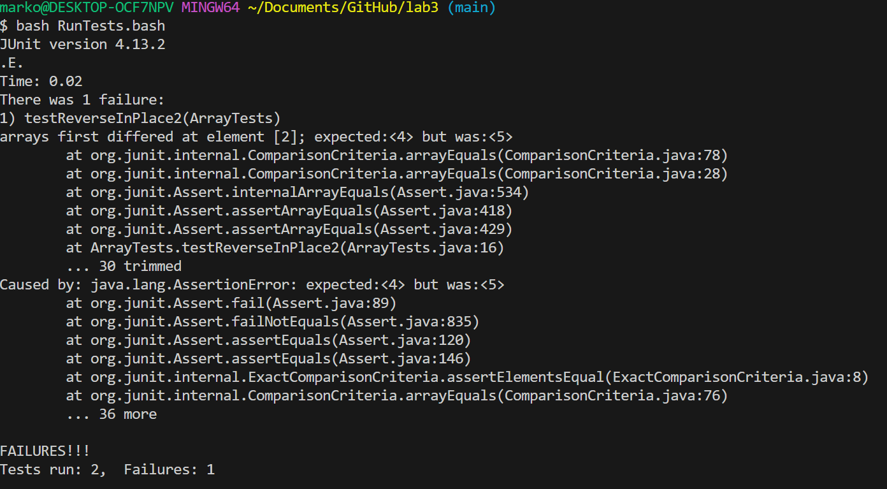

# Part 1 #

* A failure-inducing input for the buggy program, as a JUnit test and any associated code (write it as a code block in Markdown)

```ruby
@Test 
public void testReverseInPlace2() {
	int[] input2 = {3,4,5 };
	ArrayExamples.reverseInPlace(input2);
	assertArrayEquals(new int[]{5,4,3 }, input2);
}


```


* An input that doesn’t induce a failure, as a JUnit test and any associated code (write it as a code block in Markdown)

```ruby
@Test 
public void testReverseInPlace1() {
    int[] input1 = { 3 };
    ArrayExamples.reverseInPlace(input1);
    assertArrayEquals(new int[]{ 3 }, input1);
}
```

* The symptom, as the output of running the tests (provide it as a screenshot of running JUnit with at least the two inputs above)




* The bug, as the before-and-after code change required to fix it (as two code blocks in Markdown)

Before
```ruby
static void reverseInPlace(int[] arr) {
    for(int i = 0; i < arr.length; i += 1) {
      arr[i] = arr[arr.length - i - 1];
    }
  }
```

After
```ruby
static void reverseInPlace(int[] arr) {
    for(int i = 0; i < arr.length/2; i += 1) {
      int temp = arr[i];
      arr[i] = arr[arr.length - i - 1];
      arr[arr.length - i - 1] = temp;
    }
  }


```


I ran both tests again(the one that induces a failure-inducing input and the one that doesn't) and they both succeeded


* Briefly describe why the fix addresses the issue

The first issue in the code was that we switched the first half of the list with the second part and then kept going. Instead, we need to stop after we have reacehd the center of the list. If there are odd number of elements the code will still work since the middle element doesn't need to be switched with itself. The second problem with the code was that it overwrites the elements instead of replacing them. To fix that we store the value of the element before overwriting it.


# Part 2 #

## researching the commands ##
For this part, I asked chat gpt: "What are some command-line options for grep with examples". Here is the output that I used of what he gave me. 

```ruby
Case-Insensitive Search (-i):
This option makes the search case-insensitive.
grep -i "pattern" file.txt

Display Line Numbers (-n):
This option shows the line numbers of matching lines.
grep -n "pattern" file.txt

Search for Whole Words (-w):
This option only matches whole words, not substrings.
grep -w "word" file.txt

Count Matching Lines (-c):
This option displays the count of matching lines instead of the lines themselves.
grep -c "pattern" file.txt
```


## Applying the commands with examples ##

* The first command-line is -i. This makes grep case insensitive as grep at default is case sensitive. Chatgpt states: "Case-Insensitive Search (-i): This option makes the search case-insensitive. grep -i "pattern" file.txt". Here is grep -i applied to two files:


```ruby
grep -i "hard" chapter-1.txt
    The passengers continued their assault and at 10:02:23, a hijacker said, "Pull it down! Pull it down!"The hijackers remained at the controls but must have judged that the passengers were only seconds from overcoming them. The airplane headed down; the control wheel was turned hard to the right. The airplane rolled onto its back, and one of the hijackers began shouting "Allah is the greatest. Allah is the greatest." With the sounds of the passenger counterattack continuing, the aircraft plowed into an empty field in Shanksville, Pennsylvania, at 580 miles per hour, about 20 minutes' flying time from Washington, D.C.
    At the White House, the video teleconference was conducted from the Situation Room by Richard Clarke, a special assistant to the president long involved in counterterrorism. Logs indicate that it began at 9:25 and included the CIA; the FBI; the departments of State, Justice, and Defense; the FAA; and the White House shelter. The FAA and CIA joined at 9:40. The first topic addressed in the White House video teleconference-at about 9:40-was the physical security of the President, the White House, and federal agencies. Immediately thereafter it was reported that a plane had hit the Pentagon. We found no evidence that video teleconference participants had any prior information that American 77 had been hijacked and was heading directly toward Washington. Indeed, it is not clear to us that the video teleconference was fully under way before 9:37, when the Pentagon was struck.
```

~~~
grep -i "early" chapter-2.txt
                by the late 1970s. At the same time, these regimes had closed off nearly all paths
                Malaise In the 1970s and early 1980s, an unprecedented flood of wealth led the then
                organization for nearly ten years. He could attract, train, and use recruits for
                clearly the leader (emir) of al Qaeda. This organization's structure included as its
                participate in terrorist actions in the United States in the early 1990s and in al
                Arabia. He continued to do so after he arrived in Sudan. In early 1992, the al Qaeda
                Asmurai, also known as Wali Khan, worked with Bin Ladin in the early 1980s and
                early years. Yet it would also be misleading to ignore the significance of these
                and to the subsequent withdrawal of U.S. forces in early 1994.
                Iraqi intelligence officer in Khartoum in late 1994 or early 1995. Bin Ladin is said
            Yet Bin Ladin was in his weakest position since his early days in the war against the
                Sudanese, clearly thought that he had new freedom to publish his appeals for jihad.
            The Embassy Bombings As early as December 1993, a team of al Qaeda operatives had
            As early as January 1994, Bin Ladin received the surveillance reports, complete with
~~~

We can see from this example that when we used -i, it printed all the lines that contained "hard" and "early" regardless of capital letters. This can be useful if you don't care about capitalization and just want to print the lines that contain the pattern.

* The second command-line is -n. It displays the line numbers that match the string as well as the lines themselves. Chatgpt states: "Display Line Numbers (-n):
This option shows the line numbers of matching lines. grep -n "pattern" file.txt". Here is grep -n applied for two files.

~~~
 grep -n "done" chapter-3.txt
103:                events as finished-case solved, justice done. It was not designed to ask if the
122:                authorizations. Most of its work is done in local offices called field offices.
214:                that the FBI's work should be done primarily by the field offices. To emphasize this
826:                taken most of the blame, saying they had done so in order to preserve the
1632:                Afghanistan as a stroke of luck. Though the CIA had virtually abandoned Afghanistan
1750:                planning "almost as professional and detailed . . . as would be done by any U.S.
1772:                done with Bin Ladin if he were actually captured. He worried that the hard evidence
1881:                might be done, the note taker wrote, "there was a dearth of bright ideas around the
2276:                nothing was then done with it."
2594:                tribals-to "do what we won't do." Schroen was disappointed too." We should have done
2820:                intelligence about . . . where [Usama Bin Ladin] was, I would have done it." Zinni
2837:                from land bases in the Persian Gulf, as was done after 9/11. Such operations would
~~~

~~~
grep -n "done" chapter-5.txt
138:            After meeting with Bin Ladin, KSM says he journeyed onward to India, Indonesia, and
139:                Malaysia, where he met with Jemaah Islamiah's Hambali. Hambali was an Indonesian
177:                attacks in Thailand, Singapore, Indonesia, and the Maldives were never executed,
195:                the key coordinator. Born and educated in Indonesia, Hambali moved to Malaysia in        
395:                KSM states that they had done so on their own after the suicide of their friend
474:            The Mes Aynak training camp was located in an abandoned Russian copper mine near
563:                the cockpit. He claims to have done what he could to case the flight, testing
928:                appears to have done the most. He terminated Shehhi's apartment lease, telling the  
~~~

As we can see the command printed the line number that contain the pattern "done". This is very useful as the lines might be long and we don't want to see the contents of the entire line, only the line number.

* The third command-line is -w. This makes grep only return words that match the string provided. This means that unless the line has the string as a whole word, it will not return the line.
Chatgpt states: "Search for Whole Words (-w): This option only matches whole words, not substrings. grep -w "word" file.txt".
Here is grep -w applied for two files:

~~~
$ grep -w "do" chapter-6.txt
                committing himself to do anything Bin Ladin ordered. He then departed for Jordan and
                left, however, reporting to Washington that Pakistan was unlikely in fact to do
                had had a lot of money to do it and a long time to do it, and I didn't want to put
                could surely do better. Military officers in the Joint Staff told us that they
                answer to do something about the Cole attack.
                missiles would not do much good and might even help al Qaeda if the strikes failed
                address the issues Clarke had listed. What to do or say about the Cole had been an
                not responded militarily, what was the Bush administration to do?
                missions-went before the group that, in the Bush NSC, would do most of the policy
                against terrorism-to push the Pakistanis to do before an al Qaeda attack what
                Washington would demand that they do after. He had made similar requests in the
                been how to do that if there had not been another attack on America. To many people,
            The FBI was struggling to build up its institutional capabilities to do more against
                ready. "I do not believe the possible recon value outweighs the risk of possible
                Tenet was appalled, telling them that they had no authority to do it, nor did
~~~

~~~
$ grep -w "do" chapter-7.txt
            Why Hazmi and Mihdhar came to California, we do not know for certain. Khalid Sheikh
                that al Qaeda had any agents in Southern California. We do not credit this
                we do not know where they went.8They appear to have obtained assistance from the
            We do not pick up their trail until February 1, 2000, when they encountered Omar al
                area, on multiple occasions, including twice within six weeks of February 1. We do
                Abdullah's alleged jailhouse statements, despite investigative efforts. We thus do
                not know when or how Hazmi and Mihdhar first came to San Diego. We do know that on
                scholarship. We do not know how or when Hazmi and Mihdhar first met Aulaqi. The
                do not know; Salmi claims not to remember the transaction. After 9/11, Salmi
                via Paris and Cincinnati. Hazmi likely picked up Hanjour at the airport. We do not
                training session. We do not know whether Atta or al Qaeda leaders knew about
                April 18. We do not know much more about Shehhi's reason for traveling to Egypt in
                he had to do.
                do in the United States. He was sent back to Dubai. Hawsawi contacted KSM, who told
                after the 9/11 attacks, "I knew they were going to do something, that is why I got
                remarked, "I will make it happen even if I do it by myself."
~~~

As we can see, grep returned only the lines that contained the word do. So for example if the line contained done and not do, the line will not be part of the output. This is very useful because sometimes we want to find a specific word and not just a string pattern.


* The last command-line is -c which displays the count of matching lines. Chatgpt states: "Count Matching Lines (-c): This option displays the count of matching lines instead of the lines themselves.
  grep -c "pattern" file.txt". Here is grep -c applied for two files.


~~~
$ grep -c "do" chapter-8.txt
53
~~~

~~~
$ grep -c "do" chapter-9.txt
74
~~~

As we can see, grep returns the number of times the string pattern has appeared in the text files. This is also very useful because sometimes we only care about the number of times the pattern appeared and we don't want to see on which specific line the pattern appeared or the contents of the line on which the pattern appeared.


