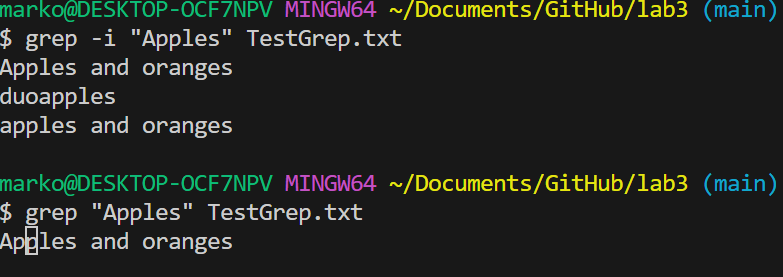
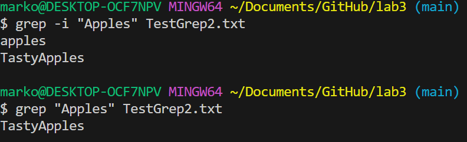
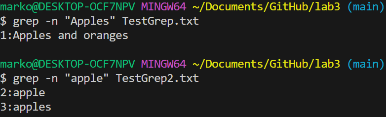
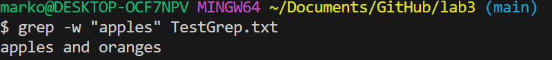
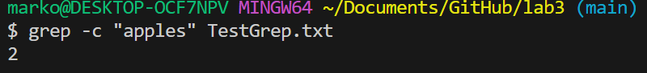
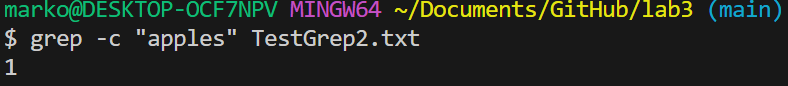

# Part 1 #

* A failure-inducing input for the buggy program, as a JUnit test and any associated code (write it as a code block in Markdown)

```ruby
@Test 
public void testReverseInPlace2() {
	int[] input2 = {3,4,5 };
	ArrayExamples.reverseInPlace(input2);
	assertArrayEquals(new int[]{5,4,3 }, input2);
}


```


* An input that doesn’t induce a failure, as a JUnit test and any associated code (write it as a code block in Markdown)

```ruby
@Test 
public void testReverseInPlace1() {
    int[] input1 = { 3 };
    ArrayExamples.reverseInPlace(input1);
    assertArrayEquals(new int[]{ 3 }, input1);
}
```

* The symptom, as the output of running the tests (provide it as a screenshot of running JUnit with at least the two inputs above)

Input that doesn't include failure


Input that induces failure


* The bug, as the before-and-after code change required to fix it (as two code blocks in Markdown)

Before
```ruby
static void reverseInPlace(int[] arr) {
    for(int i = 0; i < arr.length; i += 1) {
      arr[i] = arr[arr.length - i - 1];
    }
  }
```

After
```ruby
static void reverseInPlace(int[] arr) {
    for(int i = 0; i < arr.length/2; i += 1) {
      int temp = arr[i];
      arr[i] = arr[arr.length - i - 1];
      arr[arr.length - i - 1] = temp;
    }
  }


```


I ran both tests again(the one that induces a failure-inducing input and the one that doesn't) and they both succeeded


* Briefly describe why the fix addresses the issue

The first issue in the code was that we switched the first half of the list with the second part and then kept going. Instead, we need to stop after we have reacehd the center of the list. If there are odd number of elements the code will still work since the middle element doesn't need to be switched with itself. The second problem with the code was that it overwrites the elements instead of replacing them. To fix that we store the value of the element before overwriting it.


# Part 2 #

## researching the commands ##
For this part, I asked chat gpt: "What are some command-line options for grep with examples". Here is the output that I used of what he gave me. 

```ruby
Case-Insensitive Search (-i):
This option makes the search case-insensitive.
grep -i "pattern" file.txt

Display Line Numbers (-n):
This option shows the line numbers of matching lines.
grep -n "pattern" file.txt

Search for Whole Words (-w):
This option only matches whole words, not substrings.
grep -w "word" file.txt

Count Matching Lines (-c):
This option displays the count of matching lines instead of the lines themselves.
grep -c "pattern" file.txt
```

Here are the two files I will use as examples for every command:

TestGrep.txt			
```ruby				
Apples and oranges		
duoapples
apples and oranges
oranges
```

TestGrep2.txt
```ruby
eating aples is healthy
apple
apples
TastyApples
```

## Applying the commands with examples ##

* The first command-line is -i. This makes grep case insensitive as grep without a command line is case sensitive. Here is grep -i applied to both files:





We can see from this example that when we used -i, it printed all the lines that contained apples regardless of capital letters. We can see that that's not the case for regular grep,

* The second command-line is -n. It displays the line numbers that match the string as well as the lines themselves. Here is grep -n applied to both files.



* The third command-line is -w. This makes grep only return words that much the string provided. This means that unless the line has the string as a whole word, it will not return the line. Here is grep -w applied to both files:




As we can see, for TestGrep.txt, the grep only returned "apples and oranges" and not "duoapples". For TestGrep2.txt the grep only returned "apple" and not "apples".


* The last command-line is -c which displays the count of matching lines. Here is grep -c applied to both files.



  


