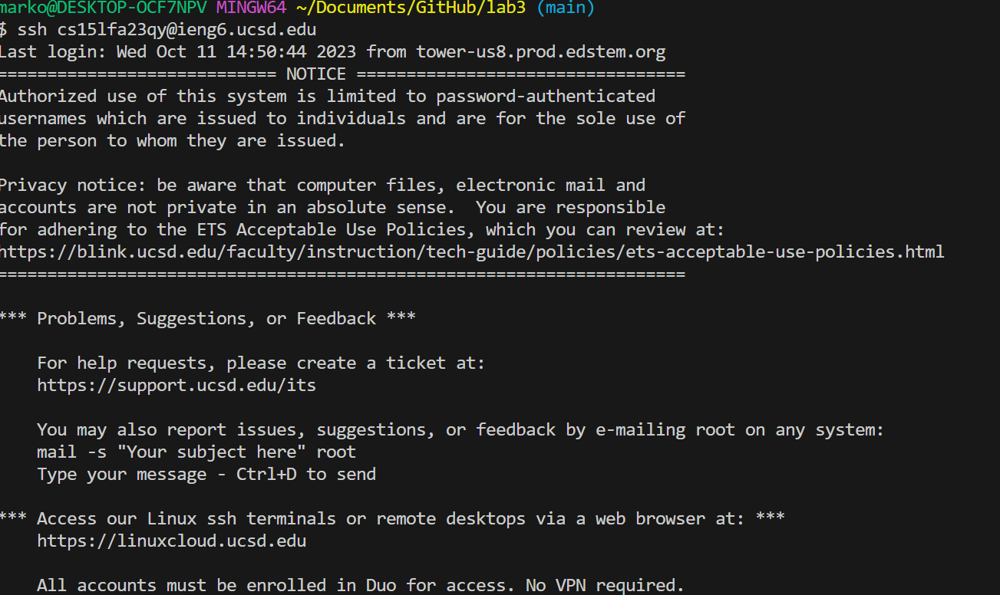
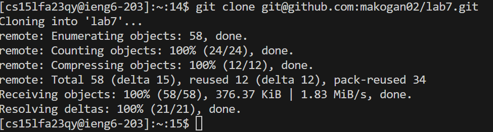
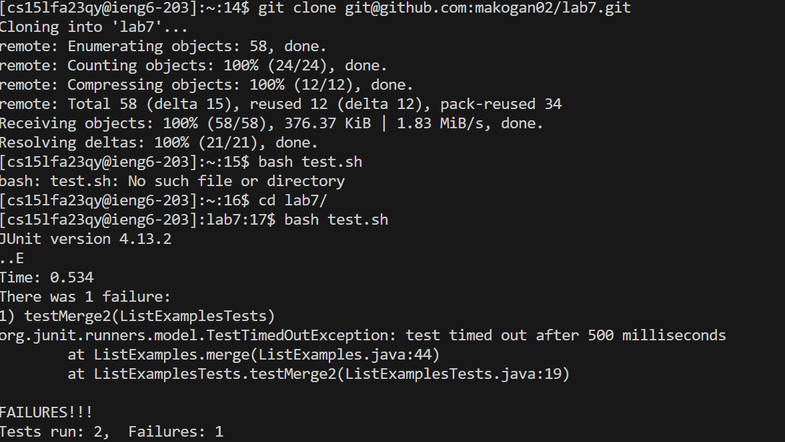
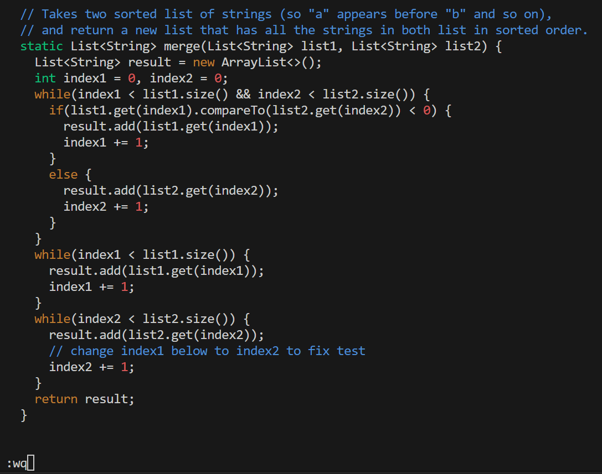
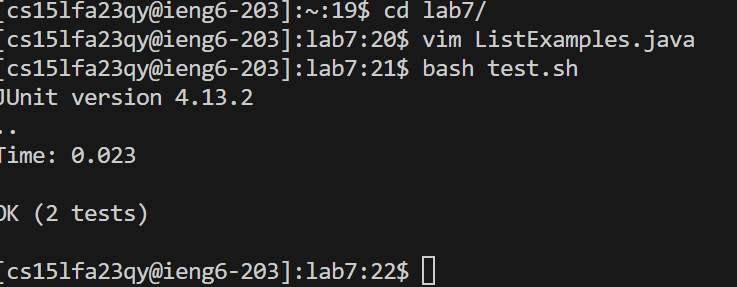
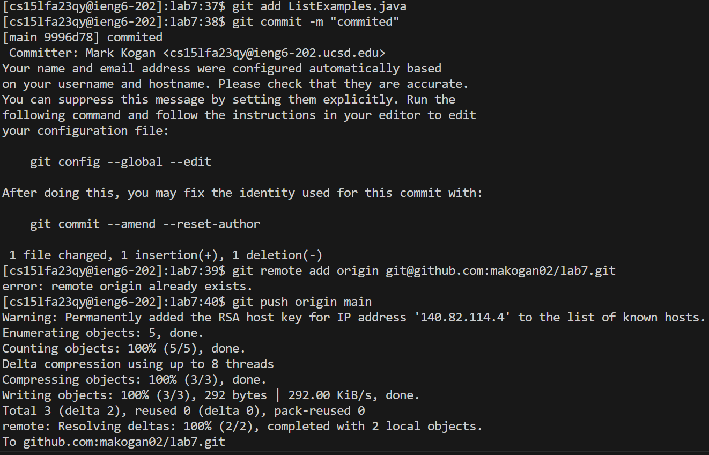

# Lab 4 #

**Note:** While doing this assignmentr my internet crashed and I was disconnected from the server multiple times. Therefore some images don't include previous step's code. 

## Step 4  ##
I pressed <ctrl+v> to paste "ssh cs15lfa23qy@ieng6.ucsd.edu" since I had it in my clipboard and pressed &lt;enter&gt;. This connected me to the remote server

## Step 5 ##
I typed "git clone " and pressed <windows key + v> to access my clipboard history. There I selected the link "git@github.com:makogan02/lab7.git" and pressed &lt;enter&gt;. The irectory was cloned into "~/lab7".

## Step 6 ##
I typed "bash test.sh" and pressed &lt;enter&gt; but I realized I need to change the working directory first. I therefore typed "cd l" and pressed <tab> to auto fill "lab7/" and pressed &lt;enter&gt;. Since I already typed the command "bash test.sh" before, I pressed <up><up> and the command "bash test.sh" was 2 up in the search history and I pressed &lt;enter&gt; again.

## Step 7 ##
I typed "vim ListExamples.java" and pressed &lt;enter&gt;. I typed "/index1" to search for all instances of index1 in the file. I then pressed &lt;enter&gt;<n><n><n><n><n><n><n><n>. This way I navigated through all the instances of "index1" in the file. The instance I needed was 8 instances down from the first appearence of "index1". I then pressed <l><l><l><l><l> until the cursos was on 1".  I then pressed <x> to delete the character "1" and pressed <i> to entr insert mode. Finally I pressed <2> to insert "2" and pressed <esc> to go out of insert mode. I then typed ":wq" and pressed &lt;enter&gt; to save the changes and exit vim.

## Step 8 ## 

I pressed <up><up><up><up> and the command "bash test.sh" was 4 up in the search history. I pressed &lt;enter&gt; and the tests passed.

## Step 9 ##

I typed "git add ListExamples.java" and pressed &lt;enter&gt; to add the file to the commit. I then typed "git commit -m "commited"" and pressed &lt;enter&gt; to commit the file to my local repository. I then typed "git remote add link origin " and then pressed <windows+v> and pasted the respirotory link "git@github.com:makogan02/lab7.git" and pressed &lt;enter&gt;. Since I had done it before and got disconnected, this time when I typed this command I got the error "remote origin already exists". I then typed "git push origin main" and pressed &lt;enter&gt; to push the changes into github. 

																																																																																																																																																																															
