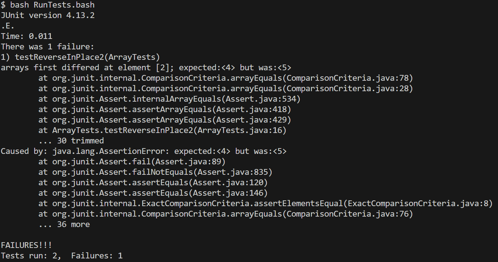

Simulating a conversation of a student with a TA.

## Student ##
Hello, I am having trouble with the ReverseInplace method. It should take all the elements in the list and put them in a reversed order. I implemented the method by going through every element in the list and switching it with the same index starting from the end. For example the first element will be switched with the last element. The second element will be switched with the second last element in the list. When I run the tests I designed, the test failed and I am not sure why. My method does look a bit too short so I am guessing I am missing some commands inside the loop but I don't see what else I need to do.

Here is my code and the symptom:

~~~
static void reverseInPlace(int[] arr) {
    for(int i = 0; i < arr.length; i += 1) {
      arr[i] = arr[arr.length - i - 1];
    }
  }
~~~

## TA ##
You have the right idea here but there are some nuances you are missing. You are right that there is more code to be written in the for loop. Notice that you are overwriting values. You are setting the element in the beginning to have the value of the element in the end but you are not "saving" the previous value of the first element i.e you are overwritting it. Also once you reach the middle of the list, notice that you already switched all the elements you need and if you keep going you reverse your work. If you address both if these issues, your code should work.

## Student ##
Oh I see what you mean. In order to not overwrite the element in the beginning of the list I save it as temp. Then I do what I did before which is switch the element in the beginning of the list with the element at the end of the list. Finally, I forgot to switch the value of the element at the end of the list so I switch that value with the element in the beginning of the list which I saved under temp. I also limited the loop to run until the middle of the list. The bug was running the loop through the entire list and also overwritting the element in the beginning of the list and not siwtching that value with the element at the end of the list.

// Changes the input array to be in reversed order
  // static void reverseInPlace(int[] arr) {
  //   for(int i = 0; i < arr.length/2; i += 1) {
  //     int temp = arr[i];
  //     arr[i] = arr[arr.length - i - 1];
  //     arr[arr.length - i - 1] = temp;
  //   }
  // }

